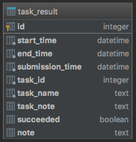

Web-service that provides REST API to manage business rules and its integrity on different systems

# Functions
## Business Rule
* extract rules from the systems
* extract a rule by ID from the systems
* create a rule on the systems (process in queue)
* update a rule on the systems (process in queue)
* delete a rule from the systems (process in queue)
## Integrity
* verify integrity
* restore integrity (process in queue)
## Task Queue
* extract task queue and currently executing task from the queue
* extract task results

# Database
  
[SQLite database schema](src/main/resources/adapter_sqlite_schema.sql)  

# Technologies and tools
* Java 8
* Spring framework (Boot, Web, Test, Actuator)
* SQLite
* JDBC
* Apache DBCP (connection pooling framework)
* Concurrency
* Message Queue
* Log4j
* Maven
* Git
* IntelliJ IDEA
* Insomnia REST Client
* Visual VM (Java profiler)
* SQLite Studio

# TODO
* implement integrity restoration
* verify rule state while integrity verification
* make task queue capacity, api key, connection pool parameters configurable
* add unit tests
* manage rule asynchronically (one thread per system) using thread pool
* take tasks from external message queue (ActiveMQ)